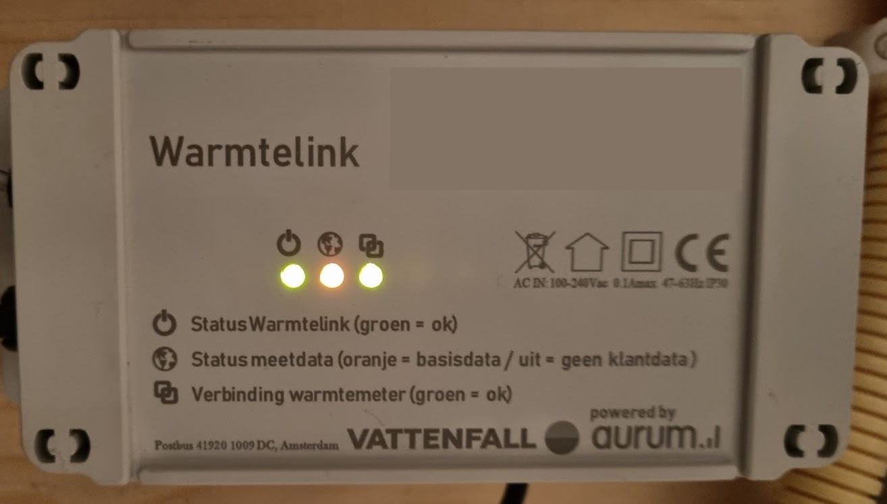

MQTT connector for DMSR district heating data
================

Very simple tool that will read total consumed data of district heating units (primarily for The Netherlands) and publish the value to an mqtt-topic.

Tested with [Warmtelink from Vattenfall](https://www.vattenfall.nl/stadsverwarming/slimme-meter/)

Requirements
============
* Warmtelink (see above)
* P1-cable
* Docker and Docker compose
* An MQTT broker (see Home Assistant example below)

Howto
=====
1. Connect the p1-cable to the Warmtelink
1. Copy `config.sample.js` to `config.js` and change its values to configure the target broker and topic
1. Ensure the `devices` list in `docker-compose.yaml` is correctly set to the dsmr-serial port of your p1-cable
1. Run `docker-compose up -d`

Home Assistant Integration
==========================
1. Setup a broker.
    1. For example using the [Mosquitto broker Add-on](https://github.com/home-assistant/addons/blob/master/mosquitto/DOCS.md)
1. Configure the connection credentials in `config.js` to point to the broker and run the container
1. Setup the Home Assistant [MQTT integration](https://www.home-assistant.io/integrations/mqtt) to retrieve the data as sensor value

Credits
=======
node-dsmr is cloned from https://github.com/reneklootwijk/node-dsmr